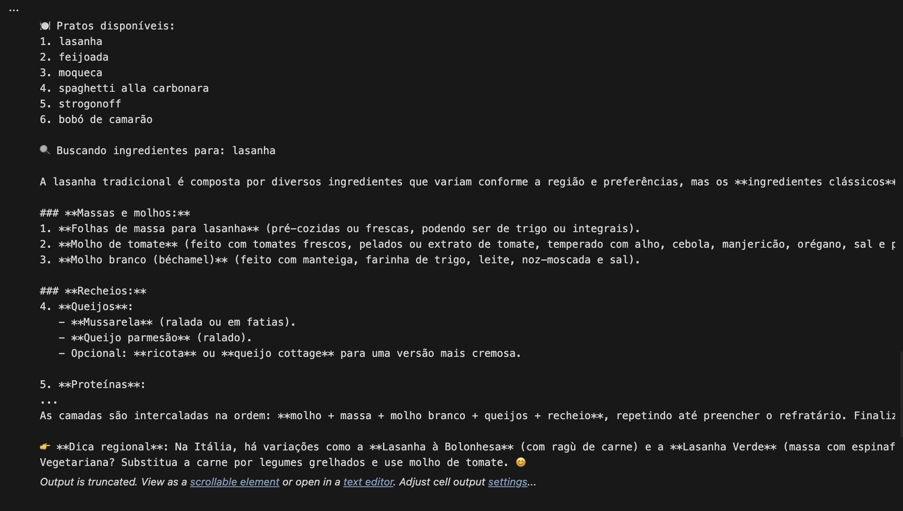

# 🧠 NLP: Intenção "ingredientes" + Deepseek

[](https://www.python.org/)
[](LICENSE)
[]()
[](https://openrouter.ai)

Este projeto amplia uma aplicação de NLP para detectar a intenção "ingredientes" e integrar com a API da Deepseek, retornando receitas de pratos selecionados pelo usuário.

---

## 🚀 Funcionalidades

- ✅ Detecção da intenção "ingredientes" com base em frases comuns
- ✅ Lista interativa de pratos disponíveis
- ✅ Validação da escolha do usuário
- ✅ Consulta à API Deepseek com retorno da receita
- ✅ Suporte à seleção múltipla de pratos
- ✅ Interface via terminal (input/output)

---

## 📦 Tecnologias utilizadas

- Python 3.10+
- Biblioteca `requests`
- API Deepseek via OpenRouter

---

🖼️ Exemplo de resposta da API



## 🧪 Como executar

1. Clone o repositório:
   ```bash
   git clone https://github.com/vynnydev/deepseek-culinary-chatbot.git
   cd deepseek-culinary-chatbot

1.  Instale as dependências:

    bash

    ```
    pip install requests

    ```

2.  Execute o notebook:

    -   Abra o arquivo `checkpoint3_ingredientes_deepseek.ipynb` no Jupyter Notebook.

    -   Execute as células.

    -   Digite uma frase como:

        Código

        ```
        Quais são os ingredientes da moqueca?

        ```

3.  Escolha um ou mais pratos da lista exibida.

4.  Insira sua chave da API Deepseek quando solicitado.

🔐 API Key
----------

Este projeto utiliza a API da Deepseek via OpenRouter. Para funcionar corretamente, você precisa de uma chave válida:

-   Obtenha sua chave em openrouter.ai

-   Insira a chave quando solicitado no terminal ou configure como variável de ambiente:

    bash

    ```
    export DEEPSEEK_API_KEY="sua-chave-aqui"

    ```

📁 Estrutura do projeto
-----------------------

Código

```
nlp-intencao-ingredientes-deepseek/
│
├── checkpoint3_ingredientes_deepseek.ipynb  # Notebook principal
├── README.md                                # Documentação do projeto
└── LICENSE                                  # Licença MIT

```

📚 Exemplos de frases reconhecidas
----------------------------------

-   "Quais são os ingredientes da feijoada?"

-   "O que tem na lasanha?"

-   "Preciso dos ingredientes do strogonoff"

-   "Buscar ingredientes da moqueca"

📌 Observações
--------------

-   Não compartilhe sua chave da API publicamente.

-   O projeto foi desenvolvido como parte do Checkpoint 3 do curso de IA.

-   Suporte à seleção múltipla está incluído para alunos que não entregaram o Checkpoint 2.

📄 Licença
----------

Este projeto está licenciado sob os termos da MIT License.